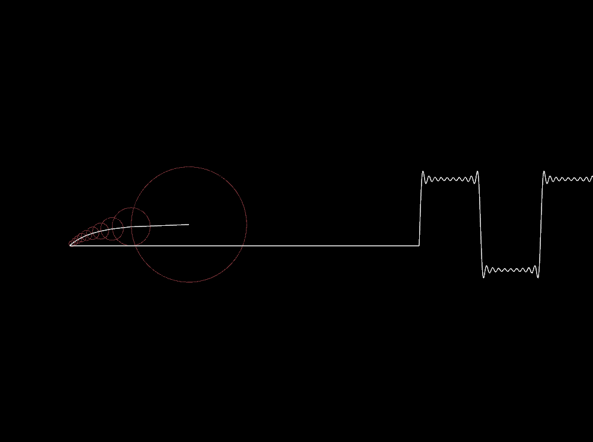

## Inspiration
I will be developing a graphical tool for viewing the Fourier series of any real function, this is inspired by [this video](https://www.youtube.com/watch?v=ds0cmAV-Yek). I thought that the creator of this visualitzation technique has come across a very elegant way of displaying/demonstrating the fourier series. My attemp to recreate this is out of passion and desire to have more individuals be able to customize the code so that they can make their own demonstrations.  

## Dependencies
The entire thing is run in python, you will need the following libraries: 
1. **numpy**:  
    `pip install numpy`
2. **scipy**:  
    `pip install scipy`
3. **matplotlib**:  
    `pip install matplotlib`
4. **arcade**:  
    `pip install arcade`

## Results
Here is an example of a square wave signal being represented by ~ 20 fourier series coefficients:

